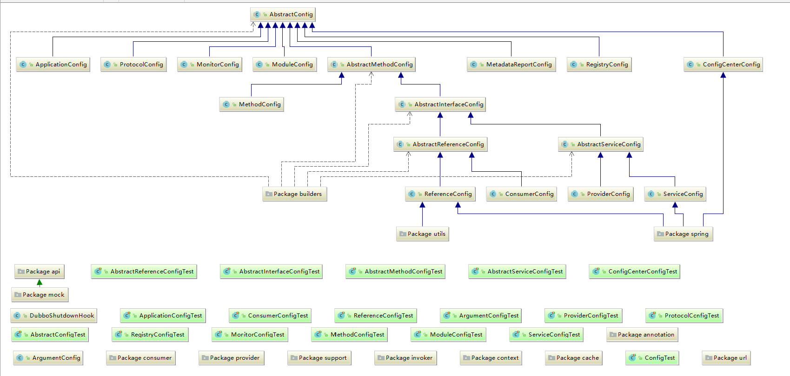

### dubbo的配置学习问题

#### 1、dubbo的配置结构
 - [dubbo官方文档，配置介绍](http://dubbo.apache.org/zh-cn/docs/user/references/xml/introduction.html)

#### 2、ApplicationConfig
 - 应用信息配置
 - [官方文档 application](http://dubbo.apache.org/zh-cn/docs/user/references/xml/dubbo-application.html)
#### 3、ModuleConfig
 - 模块配置，注册中心层级关系，区分依赖
 - [官方文档 module](http://dubbo.apache.org/zh-cn/docs/user/references/xml/dubbo-module.html)
#### 4、RegistryConfig
- 注册中心的配置信息
- [官方文档 registry](http://dubbo.apache.org/zh-cn/docs/user/references/xml/dubbo-registry.html)
#### 5、ConfigCenterBean
 - 配置中心配置信息
 - [官方文档 config](http://dubbo.apache.org/zh-cn/docs/user/references/xml/dubbo-config-center.html)
#### 6、MetadataReportConfig
#### 7、MonitorConfig
 - 监控中心配置信息
 - [官方文档 monitor](http://dubbo.apache.org/zh-cn/docs/user/references/xml/dubbo-monitor.html)
#### 8、ProviderConfig
 - 服务提供者配置信息，与serviceBean类似，提供缺省设置
 - [官方文档 provider](http://dubbo.apache.org/zh-cn/docs/user/references/xml/dubbo-provider.html)
#### 9、ConsumerConfig
 - 服务消费者配置信息，与reference类似，提供缺省设置，与其共同继承同一个父类
 - [官方文档 consumer](http://dubbo.apache.org/zh-cn/docs/user/references/xml/dubbo-consumer.html)
#### 10、ProtocolConfig
 - 协议配置信息和service配置一起使用
 - [官方文档 protocol](http://dubbo.apache.org/zh-cn/docs/user/references/xml/dubbo-protocol.html)
#### 11、ServiceBean
 - 服务提供的暴露配置设置
 - [官方文档 serviceConfig](http://dubbo.apache.org/zh-cn/docs/user/references/xml/dubbo-service.html)
#### 12、ReferenceBean
 - 服务消费者服务引用的配置
 - [官方文档 referenceConfig](http://dubbo.apache.org/zh-cn/docs/user/references/xml/dubbo-reference.html)
